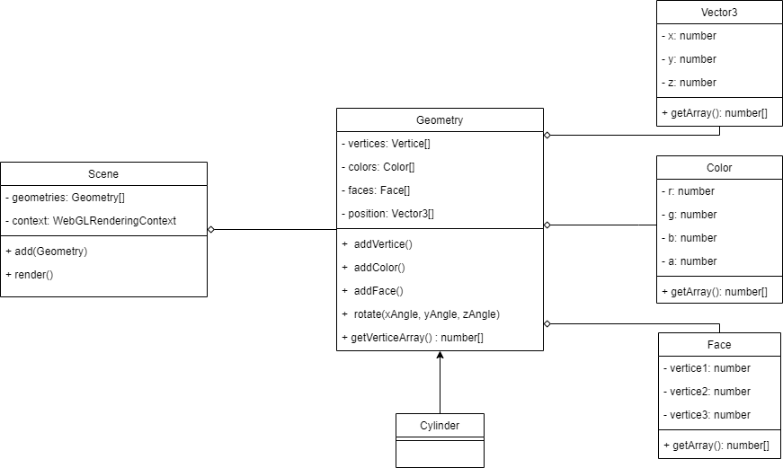

# OOP Approach

This md file is documenting how the bundle are built using Object Oriented Approach.

## Pattern

in this code provided by pak Hadziq

```js 
//Main.js File

function main() {
    //Access the canvas through DOM: Document Object Model
    var canvas = document.getElementById('myCanvas');   // The paper
    var gl = canvas.getContext('webgl');                // The brush and the paints

    // Define vertices data
    /**
     * A ( -0.5, -0.5 )
     * B (  0.5, -0.5 )
     * C (  0.5,  0.5 )
     * D ( -0.5,  0.5 )
     */

    var vertices = [
        -0.5, -0.5, 0.0, 1.0, 0.0,     // Point A
        0.5, -0.5, 0.0, 0.0, 1.0,     // Point B
        0.5, 0.5, 1.0, 0.0, 0.0,     // Point C
        0.5, 0.5, 1.0, 0.0, 0.0,     // Point C
        -0.5, 0.5, 1.0, 0.0, 0.0,     // Point D
        -0.5, -0.5, 0.0, 1.0, 0.0      // Point A
    ];

    // Create a linked-list for storing the vertices data
    var buffer = gl.createBuffer();
    gl.bindBuffer(gl.ARRAY_BUFFER, buffer);
    gl.bufferData(gl.ARRAY_BUFFER, new Float32Array(vertices), gl.STATIC_DRAW);

    var vertexShaderSource = `
        attribute vec2 aPosition;
        attribute vec3 aColor;
        varying vec3 vColor;
        uniform vec2 uChange;
        void main() {
            gl_PointSize = 10.0;
            gl_Position = vec4(aPosition + uChange, 0.0, 1.0);
            vColor = aColor;
        }
    `;

    var fragmentShaderSource = `
        precision mediump float;
        varying vec3 vColor;
        void main() {
            gl_FragColor = vec4(vColor, 1.0);    // Yellow
        }
    `;

    // Create .c in GPU
    var vertexShader = gl.createShader(gl.VERTEX_SHADER);
    gl.shaderSource(vertexShader, vertexShaderSource);
    var fragmentShader = gl.createShader(gl.FRAGMENT_SHADER);
    gl.shaderSource(fragmentShader, fragmentShaderSource);

    // Compile .c into .o
    gl.compileShader(vertexShader);
    gl.compileShader(fragmentShader);

    // Prepare a .exe shell (shader program)
    var shaderProgram = gl.createProgram();

    // Put the two .o files into the shell
    gl.attachShader(shaderProgram, vertexShader);
    gl.attachShader(shaderProgram, fragmentShader);

    // Link the two .o files, so together they can be a runnable program/context.
    gl.linkProgram(shaderProgram);

    // Start using the context (analogy: start using the paints and the brushes)
    gl.useProgram(shaderProgram);

    // Teach the computer how to collect
    //  the positional values from ARRAY_BUFFER
    //  to each vertex being processed
    var aPosition = gl.getAttribLocation(shaderProgram, "aPosition");
    gl.vertexAttribPointer(
        aPosition,
        2,
        gl.FLOAT,
        false,
        5 * Float32Array.BYTES_PER_ELEMENT,
        0
    );
    gl.enableVertexAttribArray(aPosition);
    var aColor = gl.getAttribLocation(shaderProgram, "aColor");
    gl.vertexAttribPointer(
        aColor,
        3,
        gl.FLOAT,
        false,
        5 * Float32Array.BYTES_PER_ELEMENT,
        2 * Float32Array.BYTES_PER_ELEMENT
    );
    gl.enableVertexAttribArray(aColor);

    var freeze = false;

    // Apply some interaction using mouse
    function onMouseClick(event) {
        freeze = !freeze;
    }

    document.addEventListener("click", onMouseClick, false);

    var speed = [3 / 600, 1 / 600];
    // Create a uniform to animate the vertices
    var uChange = gl.getUniformLocation(shaderProgram, "uChange");
    var change = [0, 0];

    function render() {
        if (!freeze) {
            change[0] = change[0] + speed[0];
            change[1] = change[1] + speed[1];
            gl.uniform2fv(uChange, change);
            gl.clearColor(0.1, 0.1, 0.1, 1.0);
            gl.clear(gl.COLOR_BUFFER_BIT);
            gl.drawArrays(gl.TRIANGLES, 0, 6);
        }
        requestAnimationFrame(render);
    }

    requestAnimationFrame(render);
}
```

I recognized a pattern about the shader and how the `WebGLcontext` used to render and create shader program

Especially the shader program part it just defined once, and the render function just called once in every update.

Then I came up with design to simplify the main.js program. so the `main.js` file only responsible to create an object
with vertices and it face or even a predfined object. this design is inspired by `THREE.JS` library.



here is the class diagram, and I want to all the rendering process is handled by Scene Class.

so in the `main.js` I can define only Geometries with it faces and vertices and add it to the scene.

the verbose example to add scene and add some geometry should look like this

```js

//declaring the scene
canvas = document.querySelector("#glCanvas");
scene = new Scene(canvas);

//adding the geometries
let geometry = new Geometry();

geometry.addVertice(new Vector3(0, 0, 0))
geometry.addVertice(new Vector3(0, .5, 0))
geometry.addVertice(new Vector3(.5, .5, 0))

geometry.addFace(new Face(0, 1, 2))

scene.add(geometry)

//animate (rendering the scene per frame) 
function animate() {
    requestAnimationFrame(animate);
    update();
}

function update() {
    scene.render();
}

animate() // -> and don't forget to call the animate function 
```

new ability will be added soon!

## if you interested in this design please make a contact. ありがとう


